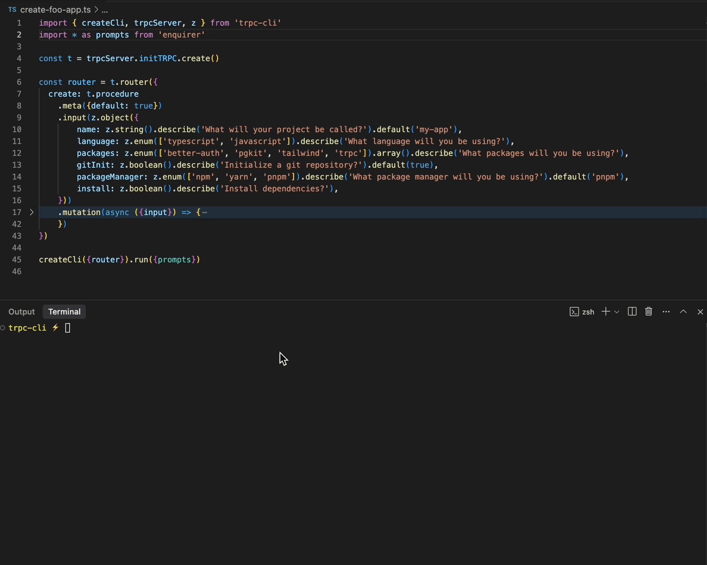
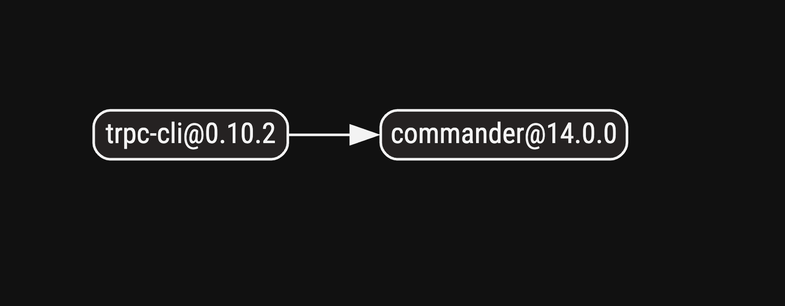

# trpc-cli [](https://github.com/mmkal/trpc-cli/actions/workflows/ci.yml/badge.svg) [](https://www.npmjs.com/package/trpc-cli) [](https://x.com/mmkalmmkal)

🔥 **Build production-quality command-line tools in minutes, not days** 🔥


trpc-cli transforms a [tRPC](https://trpc.io) router into a professional-grade CLI with zero boilerplate. Get end-to-end type safety, input validation, auto-generated help documentation, and command completion for free.

- ✅ Get all of trpc's type safety and DX building a CLI
- ✅ Automatic positional arguments and options via zod input types (or arktype, or valibot)
- ✅ Easily add subcommands via nested trpc routers
- ✅ Rich helptext out of the box
- ✅ Batteries included - no need to install any other libraries (even trpc!)
- ✅ Automatic input prompts
- ✅ Automatic shell autocompletions
- ✅ Use advanced tRPC features like context and middleware in your CLI
- ✅ Build multimodal applications - use the same router for a CLI and an HTTP server, and more
- ✅ No config needed. Run on an existing router with `npx trpc-cli src/your-router.ts`

---

## Contents

<!-- codegen:start {preset: markdownTOC, maxDepth: 3} -->
- [Contents](#contents)
- [Motivation](#motivation)
- [Installation](#installation)
- [Usage](#usage)
   - [Quickstart](#quickstart)
   - [Existing routers](#existing-routers)
   - [Disclaimer](#disclaimer)
   - [Parameters and options](#parameters-and-options)
   - [Default command](#default-command)
   - [Complex inputs with JSON](#complex-inputs-with-json)
   - [API docs](#api-docs)
   - [Calculator example](#calculator-example)
- [Validators](#validators)
   - [zod](#zod)
   - [arktype](#arktype)
   - [valibot](#valibot)
   - [effect](#effect)
- [tRPC v10 vs v11](#trpc-v10-vs-v11)
- [Output and lifecycle](#output-and-lifecycle)
- [Testing your CLI](#testing-your-cli)
- [Features and Limitations](#features-and-limitations)
- [More Examples](#more-examples)
   - [Migrator example](#migrator-example)
- [Programmatic usage](#programmatic-usage)
- [Input Prompts](#input-prompts)
- [Completions](#completions)
- [Out of scope](#out-of-scope)
- [Contributing](#contributing)
   - [Implementation and dependencies](#implementation-and-dependencies)
   - [Testing](#testing)
<!-- codegen:end -->

## Motivation

tRPC offers best-in-class type-safety and DX for building "procedures" that validate their inputs, and abide by their own contracts. This library gives you all those DX benefits, and allows mapping the procedures directly to a CLI. This offers the easiest way to build a CLI while mapping parsed options into strongly-typed inputs, and automatically outputs `--help` documentation that's always up-to-date.

This isn't just the easiest and safest way to build a CLI, but you also get all the benefits of tRPC (and zod). For inputs, you can use zod regex types, transforms, refinements, and those will map directly into useful help-text for CLI users, and corresponding type correctness when maintaining your CLI program. You can also use tRPC context and middleware functionality just like you could if you were building a server. And as an added bonus, it becomes trivially easy to turn your CLI program into a fully-functional HTTP server. Or, you could add a "programmatic usage" to your library, just by wrapping your server with the built-in `createCaller` function from tRPC. This would all, of course, have runtime and compile-time type safety.

## Installation

```
npm install trpc-cli
```

## Usage

### Quickstart

The fastest way to get going is to write a normal tRPC router, using `trpcServer` and `zod` exports from this library, and turn it into a fully-functional CLI by passing it to `createCli`:

```ts
import {createCli, trpcServer, zod as z, type TrpcCliMeta} from 'trpc-cli'

const t = trpcServer.initTRPC.meta<TrpcCliMeta>().create()

const router = t.router({
  add: t.procedure
    .input(z.object({left: z.number(), right: z.number()}))
    .query(({input}) => input.left + input.right),
})

createCli({router}).run()
```

And that's it! Your tRPC router is now a CLI program with help text and input validation. You can run it with `node yourscript add --left 2 --right 3`.

[Docs here](https://trpc.io/docs/server/routers) if you're not familiar with tRPC.

You can also create a tRPC router in the usual way using imports from `@trpc/server` and `zod` - the builtin exports are purely a convenience for simple use-case:

```ts
import {initTRPC} from '@trpc/server'
import {createCli} from 'trpc-cli'
import {z} from 'zod'

const t = initTRPC.create()

export const router = t.router({
  add: t.procedure
    .input(z.object({left: z.number(), right: z.number()}))
    .query(({input}) => input.left + input.right),
})

const cli = createCli({router})
cli.run()
```

### Existing routers

If you already have a trpc router (say, for a regular server rather), you can invoke it as a CLI without writing any additional code - just use the built in bin script:

```
npx trpc-cli src/your-router.ts
npx trpc-cli src/your-router.ts --help
npx trpc-cli src/your-router.ts yourprocedure --foo bar
```

Note - in the above example `src/your-router.ts` will be imported, and then its exports will be checked to see if they match the shape of a tRPC router. If no routers or more than one router is found, an error will be thrown.

### Disclaimer

>Note that this library is still v0, so parts of the API may change slightly. The basic usage of `createCli({router}).run()` will remain though, and any breaking changes will be published via release notes.

### Parameters and options

CLI positional arguments and options are derived from each procedure's input type. Inputs use `zod` types for the procedure to be mapped to a CLI command.

#### positional arguments

positional arguments passed to the CLI can be declared with types representing strings, numbers or booleans:

```ts
t.router({
  double: t.procedure
    .input(z.number()) //
    .query(({input}) => input * 2),
})
```

You can also use anything that accepts string, number, or boolean inputs, like `z.enum(['up', 'down'])`, `z.number().int()`, `z.literal(123)`, `z.string().regex(/^\w+$/)` etc.

Multiple positional arguments can use a `z.tuple(...)` input type:

```ts
t.router({
  add: t.procedure
    .input(z.tuple([z.number(), z.number()]))
    .query(({input}) => input[0] + input[1]),
})
```

Which is invoked like `path/to/cli add 2 3` (outputting `5`).

>Note: positional arguments can use `.optional()` or `.nullish()`, but not `.nullable()`.

>Note: positional arguments can be named using `.describe('name of parameter')`, but names should not include any special characters.

>Note: positional arguments are parsed based on the expected target type. Booleans must be written as `true` or `false`, spelled out. In most cases, though, you'd be better off using [options](#options) for boolean inputs.

Array/spread parameters can use an array input type:

```ts
t.router({
  lint: t.procedure
    .input(z.array(z.string()).describe('file paths to lint'))
    .mutation(({input}) => {
      lintFiles(input.map(file => path.join(process.cwd(), file)))
    }),
})
```

Which is invoked like `path/to/mycli lint file1 file2 file3 file4`.

Array inputs can also be used with [options](#options) by nesting them in a tuple.

```ts
t.router({
  lint: t.procedure
    .input(
      z.tuple([
        z.array(z.string()).describe('file paths to lint'),
        z.object({maxWarnings: z.number().default(10)}),
      ]),
    )
    .mutation(({input}) => {
      const result = lintFiles(
        input.files.map(file => path.join(process.cwd(), file)),
      )
      if (result.warnings.length > input.maxWarnings) {
        throw new Error(`Too many warnings: ${result.warnings.length}`)
      }
    }),
})
```

Which could be invoked with any of:

- `mycli lint file1 file2 file3 file4 --max-warnings 10`
- `mycli lint file1 file2 file3 file4 --maxWarnings=10`
- `mycli lint --maxWarnings=10 file1 file2 file3 file4`
- `mycli lint --maxWarnings 10 file1 file2 file3 file4`

#### Options

`z.object(...)` inputs become options (passed with `--foo bar` or `--foo=bar`) syntax. Values are accepted in `--kebab-case`, and are parsed like in most CLI programs:

Strings:

- `z.object({foo: z.string()})` will map:
  - `--foo bar` or `--foo=bar` to `{foo: 'bar'}`

Booleans:

- `z.object({foo: z.boolean()})` or `z.object({foo: z.boolean().default(false)})` will map:
   - no option supplied to `{foo: false}`
   - `--foo` `{foo: true}`

- `z.object({foo: z.boolean().default(true)})` will map:
   - no option supplied to `{foo: true}`
   - `--no-foo` `{foo: false}`

- `z.object({foo: z.boolean().optional()})` will map:
  - no option supplied to `{}` (foo is undefined)
  - `--foo` to `{foo: true}`
  - `--foo false` to `{foo: false}` (note: `--no-foo` doesn't work here, because its existence prevents `{}` from being the default value)

Numbers:

- `z.object({foo: z.number()})` will map:
   - `--foo 1` or `--foo=1` to `{foo: 1}`

Other types:
- `z.object({ foo: z.object({ bar: z.number() }) })` will parse inputs as JSON:
   - `--foo '{"bar": 1}'` maps to `{foo: {bar: 1}}`

Multi-word options:

- `z.object({ multiWord: z.string() })` will map:
  - `--multi-word foo` to `{multiWord: 'foo'}`

Unions and intersections should also work as expected, but make sure to test them thoroughly, especially if they are deeply-nested.

#### Both

To use positional arguments _and_ options, use a tuple with an object at the end:

```ts
t.router({
  copy: t.procedure
    .input(
      z.tuple([
        z.string().describe('source'),
        z.string().describe('target'),
        z.object({
          mkdirp: z
            .boolean()
            .optional()
            .describe("Ensure target's parent directory exists before copying"),
        }),
      ]),
    )
    .mutation(async ({input: [source, target, opts]}) => {
      if (opts.mkdirp) {
        await fs.mkdir(path.dirname(target, {recursive: true}))
      }
      await fs.copyFile(source, target)
    }),
})
```

You might use the above with a command like:

```
path/to/cli copy a.txt b.txt --mkdirp
```

>Note: object types for options must appear _last_ in the `.input(...)` tuple, when being used with positional arguments. So `z.tuple([z.string(), z.object({mkdirp: z.boolean()}), z.string()])` would not be allowed.

>You can pass an existing tRPC router that's primarily designed to be deployed as a server, in order to invoke your procedures directly in development.

### Default command

You can define a default command for your CLI - set this to the procedure that should be invoked directly when calling your CLI. Useful for simple CLIs that only do one thing, or when you want to make the most common command very quick to type (e.g. `yarn` being an alias for `yarn install`):

```ts
#!/usr/bin/env node
// filename: yarn
const router = t.router({
  install: t.procedure //
    .meta({default: true})
    .mutation(() => console.log('installing...')),
})

const cli = createCli({router})

cli.run()
```

The above can be invoked with either `yarn` or `yarn install`. You can also set `default: true` on subcommands, which makes them the default for their parent.

### Complex inputs with JSON

Procedures with inputs that cannot be cleanly mapped to positional arguments and CLI options are automatically configured to accept a JSON string via the `--input` option. This ensures that every procedure in your router is accessible via the CLI, even those with complex input types.

```ts
const router = t.router({
  foo: t.procedure
    // This input type can't be directly mapped to CLI arguments
    // (object in the middle of a tuple doesn't work for positional args):
    .input(z.tuple([z.string(), z.object({abc: z.string()}), z.string()]))
    .query(({input}) => `Got ${input[0]}, ${input[1].abc}, and ${input[2]}`),
})

const cli = createCli({router})

// Even though the input isn't ideal for CLI, you can still use it:
// mycli foo --input '["first", {"abc": "middle"}, "last"]'
```

Rather than ignoring these procedures, trpc-cli makes them available through JSON input, allowing you to pass complex data structures that wouldn't work well with traditional CLI arguments.

You can also explicitly opt into this behavior for any procedure by setting `jsonInput: true` in its meta, regardless of whether its input could be mapped to CLI arguments.

### API docs

<!-- codegen:start {preset: markdownFromJsdoc, source: src/index.ts, export: createCli} -->
#### [createCli](./src/index.ts#L53)

Run a trpc router as a CLI.

##### Params

|name      |description                                                                              |
|----------|-----------------------------------------------------------------------------------------|
|router    |A trpc router                                                                            |
|context   |The context to use when calling the procedures - needed if your router requires a context|
|trpcServer|The trpc server module to use. Only needed if using trpc v10.                            |

##### Returns

A CLI object with a `run` method that can be called to run the CLI. The `run` method will parse the command line arguments, call the appropriate trpc procedure, log the result and exit the process. On error, it will log the error and exit with a non-zero exit code.
<!-- codegen:end -->

### Calculator example

Here's a more involved example, along with what it outputs:

<!-- codegen:start {preset: custom, require: tsx/cjs, source: ./readme-codegen.ts, export: dump, file: test/fixtures/calculator.ts} -->
<!-- hash:e30cac4beb319a42941777d631465ee0 -->
```ts
import {createCli, type TrpcCliMeta, trpcServer} from 'trpc-cli'
import {z} from 'zod'

const trpc = trpcServer.initTRPC.meta<TrpcCliMeta>().create()

const router = trpc.router({
  add: trpc.procedure
    .meta({
      description:
        'Add two numbers. Use this if you and your friend both have apples, and you want to know how many apples there are in total.',
    })
    .input(z.tuple([z.number(), z.number()]))
    .query(({input}) => input[0] + input[1]),
  subtract: trpc.procedure
    .meta({
      description:
        'Subtract two numbers. Useful if you have a number and you want to make it smaller.',
    })
    .input(z.tuple([z.number(), z.number()]))
    .query(({input}) => input[0] - input[1]),
  multiply: trpc.procedure
    .meta({
      description:
        'Multiply two numbers together. Useful if you want to count the number of tiles on your bathroom wall and are short on time.',
    })
    .input(z.tuple([z.number(), z.number()]))
    .query(({input}) => input[0] * input[1]),
  divide: trpc.procedure
    .meta({
      version: '1.0.0',
      description:
        "Divide two numbers. Useful if you have a number and you want to make it smaller and `subtract` isn't quite powerful enough for you.",
      examples: 'divide --left 8 --right 4',
    })
    .input(
      z.tuple([
        z.number().describe('numerator'),
        z
          .number()
          .refine(n => n !== 0)
          .describe('denominator'),
      ]),
    )
    .mutation(({input}) => input[0] / input[1]),
  squareRoot: trpc.procedure
    .meta({
      description:
        'Square root of a number. Useful if you have a square, know the area, and want to find the length of the side.',
    })
    .input(z.number())
    .query(({input}) => {
      if (input < 0) throw new Error(`Get real`)
      return Math.sqrt(input)
    }),
})

void createCli({router}).run()
```
<!-- codegen:end -->


Run `node path/to/cli --help` for formatted help text for the `sum` and `divide` commands.

<!-- codegen:start {preset: custom, require: tsx/cjs, source: ./readme-codegen.ts, export: command, command: './node_modules/.bin/tsx test/fixtures/calculator --help'} -->
`node path/to/calculator --help` output:

```
Usage: calculator [options] [command]

Options:
  -h, --help                            display help for command

Commands:
  add <parameter_1> <parameter_2>       Add two numbers. Use this if you and
                                        your friend both have apples, and you
                                        want to know how many apples there are
                                        in total.
  subtract <parameter_1> <parameter_2>  Subtract two numbers. Useful if you have
                                        a number and you want to make it
                                        smaller.
  multiply <parameter_1> <parameter_2>  Multiply two numbers together. Useful if
                                        you want to count the number of tiles on
                                        your bathroom wall and are short on
                                        time.
  divide <numerator> <denominator>      Divide two numbers. Useful if you have a
                                        number and you want to make it smaller
                                        and `subtract` isn't quite powerful
                                        enough for you.
  square-root <number>                  Square root of a number. Useful if you
                                        have a square, know the area, and want
                                        to find the length of the side.
  help [command]                        display help for command
```
<!-- codegen:end -->

You can also show help text for the corresponding procedures (which become "commands" in the CLI):

<!-- codegen:start {preset: custom, require: tsx/cjs, source: ./readme-codegen.ts, export: command, command: './node_modules/.bin/tsx test/fixtures/calculator add --help'} -->
`node path/to/calculator add --help` output:

```
Usage: calculator add [options] <parameter_1> <parameter_2>

Add two numbers. Use this if you and your friend both have apples, and you want
to know how many apples there are in total.

Arguments:
  parameter_1  number (required)
  parameter_2  number (required)

Options:
  -h, --help   display help for command

```
<!-- codegen:end -->

When passing a command along with its options, the return value will be logged to stdout:

<!-- codegen:start {preset: custom, require: tsx/cjs, source: ./readme-codegen.ts, export: command, command: './node_modules/.bin/tsx test/fixtures/calculator add 2 3'} -->
`node path/to/calculator add 2 3` output:

```
5
```
<!-- codegen:end -->

Invalid inputs are helpfully displayed, along with help text for the associated command:

<!-- codegen:start {preset: custom, require: tsx/cjs, source: ./readme-codegen.ts, export: command, command: './node_modules/.bin/tsx test/fixtures/calculator add 2 notanumber', reject: false} -->
`node path/to/calculator add 2 notanumber` output:

```
error: command-argument value 'notanumber' is invalid for argument 'parameter_2'. Invalid number: notanumber


Usage: calculator add [options] <parameter_1> <parameter_2>

Add two numbers. Use this if you and your friend both have apples, and you want
to know how many apples there are in total.

Arguments:
  parameter_1  number (required)
  parameter_2  number (required)

Options:
  -h, --help   display help for command

```
<!-- codegen:end -->


Note that procedures can define [`meta`](https://trpc.io/docs/server/metadata#create-router-with-typed-metadata) value with `description`, `usage` and `help` props. Zod's [`describe`](https://zod.dev/?id=describe) method allows adding descriptions to individual options.

```ts
import {type TrpcCliMeta} from 'trpc-cli'

const trpc = initTRPC.meta<TrpcCliMeta>().create() // `TrpcCliMeta` is a helper interface with description, usage, and examples, but you can use your own `meta` interface, anything with a `description?: string` property will be fine

const appRouter = trpc.router({
  divide: trpc.procedure
    .meta({
      description:
        'Divide two numbers. Useful when you have a pizza and you want to share it equally between friends.',
    })
    .input(
      z.object({
        left: z.number().describe('The numerator of the division operator'),
        right: z.number().describe('The denominator of the division operator'),
      }),
    )
    .mutation(({input}) => input.left / input.right),
})
```

## Validators

You can use any validator that [trpc supports](https://trpc.io/docs/server/validators), but for inputs to be converted into CLI arguments/options, they must be JSON schema compatible. The following validators are supported so far. Contributions are welcome for other validators - the requirement is that they must have a helper function that converts them into a JSON schema representation.

Note that JSON schema representations are not in general perfect 1-1 mappings with every validator library's API, so some procedures may default to use the JSON `--input` option instead.

### zod

Zod support is built-in, including the `zod-to-json-schema` conversion helper. You can also "bring your own" zod module (e.g. if you want to use a newer/older version of zod than the one included in `trpc-cli`).

#### zod v4

You can use zod v4 right now, but you'll need to pass it in to `createCli` so that trpc-cli knows how to format errors and parse your router's inputs:

```ts
import * as zod from 'zod' // zod v4!

const cli = createCli({
  router: myRouter,
  zod,
})
```

And that's it! Everything else will *just work*. You can start taking advantage of zod's new `meta` feature too to improve parameter names:

```ts
const myRouter = t.router({
  createFile: t.procedure
    .input(
      z.string().meta({
        title: 'filepath',
        description: 'Path to the file to be created',
      }),
    )
    .mutation(async ({input}) => {
      /* */
    }),
})
```

### arktype

`arktype` includes a `toJsonSchema` method on its types, so no extra dependencies are reuqired if you're using arktype to validate your inputs.

```ts
import {type} from 'arktype'
import {type TrpcCliMeta} from 'trpc-cli'

const t = initTRPC.meta<TrpcCliMeta>().create()

const router = t.router({
  add: t.procedure
    .input(type({left: 'number', right: 'number'}))
    .query(({input}) => input.left + input.right),
})

const cli = createCli({router})

cli.run() // e.g. `mycli add --left 1 --right 2`
```

- Note: you will need to install `arktype` as a dependency separately
- Note: some arktype features result in types that can't be converted cleanly to CLI args/options, so for some procedures you may need to use the `--input` option to pass in a JSON string. Check your CLI help text to see if this is the case. See https://github.com/arktypeio/arktype/issues/1379 for more info.

### valibot

Valibot support is enabled via the `@valibot/to-json-schema` package. Simply install it as a dependency and it should work. If you don't have it installed, your procedures will be mapped to commands that accept a plain JSON string as input (the help text will include a message explaining how to get richer input options).

```ts
import {type TrpcCliMeta} from 'trpc-cli'
import * as v from 'valibot'

const t = initTRPC.meta<TrpcCliMeta>().create()

const router = t.router({
  add: t.procedure
    .input(v.tuple([v.number(), v.number()]))
    .query(({input}) => input[0] + input[1]),
})

const cli = createCli({router})

cli.run() // e.g. `mycli add 1 2`
```

### effect

You can also use `effect` schemas - see [trpc docs on using effect validators](https://trpc.io/docs/server/validators#with-effect) - you'll need to use the `Schema.standardSchemaV1` helper that ships with `effect`:

>Note: `effect` support requires `effect >= 3.14.2` (which in turn depends on `@trpc/server >= 11.0.1` if passing in a custom `trpcServer`).

```ts
import {Schema} from 'effect'
import {type TrpcCliMeta} from 'trpc-cli'

const t = initTRPC.meta<TrpcCliMeta>().create()

const router = t.router({
  add: t.procedure
    .input(Schema.standardSchemaV1(Schema.Tuple(Schema.Number, Schema.Number)))
    .query(({input}) => input.left + input.right),
})

const cli = createCli({router, trpcServer: import('@trpc/server')})

cli.run() // e.g. `mycli add 1 2`
```

## tRPC v10 vs v11

Both versions 10 and 11 of `@trpc/server` are both supported. v11 is included in the dependencies of this packages, so that you can use it out of the box, but you can also use your own installation. If using tRPC v10 you must pass in your `@trpc/server` module to `createCli`:

```ts
const cli = createCli({router, trpcServer: import('@trpc/server')})
```

Or you can use top level await or `require` if you prefer:

```ts
const cli = createCli({router, trpcServer: await import('@trpc/server')})
const cli = createCli({router, trpcServer: require('@trpc/server')})
```

Note: previously, when trpc v11 was in preview, v10 was included in the dependencies.

## Output and lifecycle

The output of the command will be logged if it is truthy. The log algorithm aims to be friendly for bash-piping, usage with jq etc.:

- Arrays will be logged line be line
- For each line logged:
   - string, numbers and booleans are logged directly
   - objects are logged with `JSON.stringify(___, null, 2)`

So if the procedure returns `['one', 'two', 'three]` this will be written to stdout:

```
one
two
three
```

If the procedure returns `[{name: 'one'}, {name: 'two'}, {name: 'three'}]` this will be written to stdout:

```
{
  "name": "one"
}
{
  "name": "two"
}
{
  "name": "three"
}
```

This is to make it as easy as possible to use with other command line tools like `xargs`, `jq` etc. via bash-piping. If you don't want to rely on this logging, you can always log inside your procedures however you like and avoid returning a value.

The process will exit with code 0 if the command was successful, or 1 otherwise. 

You can also override the `logger` and `process` properties of the `run` method to change the default return-value logging and/or process.exit behaviour:

<!-- eslint-disable unicorn/no-process-exit -->
```ts
import {createCli} from 'trpc-cli'

const cli = createCli({router: yourRouter})

cli.run({
  logger: yourLogger, // should define `.info` and `.error` methods
  process: {
    exit: code => {
      if (code === 0) process.exit(0)
      else process.exit(123)
    },
  },
})
```

You could also override `process.exit` to avoid killing the process at all - see [programmatic usage](#programmatic-usage) for an example.

## Testing your CLI

Rather than testing your CLI via a subprocess, which is slow and doesn't provide great DX, it's better to use the router that is passed to it directly with [`createCallerFactory`](https://trpc.io/docs/server/server-side-calls#create-caller):

```ts
import {initTRPC} from '@trpc/server'
import {test, expect} from 'your-test-library'
import {router} from '../src'

const caller = initTRPC.create().createCallerFactory(router)({})

test('add', async () => {
  expect(await caller.add([2, 3])).toBe(5)
})
```

If you really want to test it as like a CLI and want to avoid a subprocess, you can also call the `run` method programmatically, and override the `process.exit` call and extract the resolve/reject values from `FailedToExitError`:

```ts
import {createCli, FailedToExitError} from 'trpc-cli'

const run = async (argv: string[]) => {
  const cli = createCli({router: calculatorRouter})
  return cli
    .run({
      argv,
      process: {exit: () => void 0 as never},
      logger: {info: () => {}, error: () => {}},
    })
    .catch(err => {
      // this will always throw, because our `exit` handler doesn't throw or exit the process
      while (err instanceof FailedToExitError) {
        if (err.exitCode === 0) {
          return err.cause // this is the return value of the procedure that was invoked
        }
        err = err.cause // use the underlying error that caused the exit
      }
      throw err
    })
}

test('make sure parsing works correctly', async () => {
  await expect(run(['add', '2', '3'])).resolves.toBe(5)
  await expect(run(['squareRoot', '--value=4'])).resolves.toBe(2)
  await expect(run(['squareRoot', `--value=-1`])).rejects.toMatchInlineSnapshot(
    `[Error: Get real]`,
  )
  await expect(run(['add', '2', 'notanumber'])).rejects.toMatchInlineSnapshot(`
    [Error: Validation error
      - Expected number, received string at index 1

    Usage: program add [options] <parameter_1> <parameter_2>

    Arguments:
      parameter_1   (required)
      parameter_2   (required)

    Options:
      -h, --help   display help for command
    ]
  `)
})
```

This will give you strong types for inputs and outputs, and is essentially what `trpc-cli` does under the hood after parsing and validating command-line input.

In general, you should rely on `trpc-cli` to correctly handle the lifecycle and output etc. when it's invoked as a CLI by end-users. If there are any problems there, they should be fixed on this repo - please raise an issue.

## Features and Limitations

- Nested subrouters ([example](./test/fixtures/migrations.ts)) - procedures in nested routers will become subcommands will be dot separated e.g. `mycli search byId --id 123`
- Middleware, `ctx`, multi-inputs work as normal
- Return values are logged using `console.info` (can be configured to pass in a custom logger)
- `process.exit(...)` called with either 0 or 1 depending on successful resolve
- Help text shown on invalid inputs
- Support option aliases via `aliases` meta property (see migrations example below)
- Union types work, but they should ideally be non-overlapping for best results
- Limitation: Only zod types are supported right now
- Limitation: Only object types are allowed as input. No positional arguments supported
   - If there's interest, this could be added in future for inputs of type `z.string()` or `z.tuple([z.string(), ...])`
- Limitation: Nested-object input props must be passed as json
   - e.g. `z.object({ foo: z.object({ bar: z.number() }) }))` can be supplied via using `--foo '{"bar": 123}'`
- Limitation: No `subscription` support.
   - In theory, this might be supportable via `@inquirer/prompts`. Proposals welcome!

## More Examples

### Migrator example

Given a migrations router looking like this:

<!-- codegen:start {preset: custom, require: tsx/cjs, source: ./readme-codegen.ts, export: dump, file: test/fixtures/migrations.ts} -->
<!-- hash:72921e331afb12cbf349fa2e980c9f26 -->
```ts
import {createCli, type TrpcCliMeta, trpcServer, z} from 'trpc-cli'
import * as trpcCompat from '../../src/trpc-compat'

const trpc = trpcServer.initTRPC.meta<TrpcCliMeta>().create()

const migrations = getMigrations()

const searchProcedure = trpc.procedure
  .meta({
    aliases: {
      options: {status: 's'},
    },
  })
  .input(
    z.object({
      status: z
        .enum(['executed', 'pending'])
        .optional()
        .describe('Filter to only show migrations with this status'),
    }),
  )
  .use(async ({next, input}) => {
    return next({
      ctx: {
        filter: (list: typeof migrations) =>
          list.filter(m => !input.status || m.status === input.status),
      },
    })
  })

export const router = trpc.router({
  up: trpc.procedure
    .meta({
      description:
        'Apply migrations. By default all pending migrations will be applied.',
    })
    .input(
      z.union([
        z.object({}).strict(), // use strict here to make sure `{step: 1}` doesn't "match" this first, just by having an ignore `step` property
        z.object({
          to: z.string().describe('Mark migrations up to this one as exectued'),
        }),
        z.object({
          step: z
            .number()
            .int()
            .positive()
            .describe('Mark this many migrations as executed'),
        }),
      ]),
    )
    .query(async ({input}) => {
      let toBeApplied = migrations
      if ('to' in input) {
        const index = migrations.findIndex(m => m.name === input.to)
        toBeApplied = migrations.slice(0, index + 1)
      }
      if ('step' in input) {
        const start = migrations.findIndex(m => m.status === 'pending')
        toBeApplied = migrations.slice(0, start + input.step)
      }
      toBeApplied.forEach(m => (m.status = 'executed'))
      return migrations.map(m => `${m.name}: ${m.status}`)
    }),
  create: trpc.procedure
    .meta({description: 'Create a new migration'})
    .input(
      z.object({name: z.string(), content: z.string()}), //
    )
    .mutation(async ({input}) => {
      migrations.push({...input, status: 'pending'})
      return migrations
    }),
  list: searchProcedure
    .meta({description: 'List all migrations'})
    .query(({ctx}) => ctx.filter(migrations)),
  search: trpc.router({
    byName: searchProcedure
      .meta({description: 'Look for migrations by name'})
      .input(z.object({name: z.string()}))
      .query(({ctx, input}) => {
        return ctx.filter(migrations.filter(m => m.name === input.name))
      }),
    byContent: searchProcedure
      .meta({
        description: 'Look for migrations by their script content',
        aliases: {
          options: {searchTerm: 'q'},
        },
      })
      .input(
        z.object({
          searchTerm: z
            .string()
            .describe(
              'Only show migrations whose `content` value contains this string',
            ),
        }),
      )
      .query(({ctx, input}) => {
        return ctx.filter(
          migrations.filter(m => m.content.includes(input.searchTerm)),
        )
      }),
  }),
}) satisfies trpcCompat.Trpc11RouterLike

if (require.main === module) {
  const cli = createCli({router})
  void cli.run()
}
function getMigrations() {
  return [
    {
      name: 'one',
      content: 'create table one(id int, name text)',
      status: 'executed',
    },
    {
      name: 'two',
      content: 'create view two as select name from one',
      status: 'executed',
    },
    {
      name: 'three',
      content: 'create table three(id int, foo int)',
      status: 'pending',
    },
    {
      name: 'four',
      content: 'create view four as select foo from three',
      status: 'pending',
    },
    {name: 'five', content: 'create table five(id int)', status: 'pending'},
  ]
}
```
<!-- codegen:end -->

Here's how the CLI will work:

<!-- codegen:start {preset: custom, require: tsx/cjs, source: ./readme-codegen.ts, export: command, command: './node_modules/.bin/tsx test/fixtures/migrations --help'} -->
`node path/to/migrations --help` output:

```
Usage: migrations [options] [command]

Options:
  -h, --help        display help for command

Commands:
  up [options]      Apply migrations. By default all pending migrations will be
                    applied.
  create [options]  Create a new migration
  list [options]    List all migrations
  search            Available subcommands: by-name, by-content
  help [command]    display help for command

```
<!-- codegen:end -->

<!-- codegen:start {preset: custom, require: tsx/cjs, source: ./readme-codegen.ts, export: command, command: './node_modules/.bin/tsx test/fixtures/migrations apply --help'} -->
`node path/to/migrations apply --help` output:

```
Usage: migrations [options] [command]

Options:
  -h, --help        display help for command

Commands:
  up [options]      Apply migrations. By default all pending migrations will be
                    applied.
  create [options]  Create a new migration
  list [options]    List all migrations
  search            Available subcommands: by-name, by-content
  help [command]    display help for command

```
<!-- codegen:end -->

<!-- codegen:start {preset: custom, require: tsx/cjs, source: ./readme-codegen.ts, export: command, command: './node_modules/.bin/tsx test/fixtures/migrations search.byContent --help'} -->
`node path/to/migrations search.byContent --help` output:

```
Usage: migrations [options] [command]

Options:
  -h, --help        display help for command

Commands:
  up [options]      Apply migrations. By default all pending migrations will be
                    applied.
  create [options]  Create a new migration
  list [options]    List all migrations
  search            Available subcommands: by-name, by-content
  help [command]    display help for command

```
<!-- codegen:end -->

## Programmatic usage

This library should probably _not_ be used programmatically - the functionality all comes from a trpc router, which has [many other ways to be invoked](https://trpc.io/docs/community/awesome-trpc) (including the built-in `createCaller` helper bundled with `@trpc/server`).

The `.run()` function does return a value, but it's typed as `unknown` since the input is just `argv: string[]` . But if you really need to for some reason, you could override the `console.error` and `process.exit` calls:

```ts
import {createCli} from 'trpc-cli'

const cli = createCli({router: yourAppRouter})

const runCli = async (argv: string[]) => {
  return new Promise<void>((resolve, reject) => {
    cli.run({
      argv,
      logger: yourLogger, // needs `info` and `error` methods, at least
      process: {
        exit: code => {
          if (code === 0) {
            resolve()
          } else {
            reject(`CLI failed with exit code ${code}`)
          }
        },
      },
    })
  })
}
```

## Input Prompts

You can enable prompts for positional arguments and options simply by installing `enquirer`, `prompts` or `@inquirer/prompts`:



```bash
npm install @inquirer/prompts
```

The pass it in when running your CLI:

```ts
import * as prompts from '@inquirer/prompts' // or import * as prompts from 'enquirer', or import * as prompts from 'prompts'
import {createCli} from 'trpc-cli'

const cli = createCli({router: myRouter})

cli.run({prompts})
```

The user will then be asked to input any missing arguments or options. Booleans, numbers, enums etc. will get appropriate user-friendly prompts, along with input validation.

You can also pass in a custom "Prompter". This in theory enables you to prompt in *any way* you'd like. You will be passed a `Command` instance, and then must define `input`, `select`, `confirm` and `checkbox` prompts. You can also define `setup` and `teardown` functions which run before and after the individual prompts for arguments and options. This could be used to render an all-in-one form filling in inputs.

## Completions

> 🚧 Note: This feature is new! Please try it out and [file an issues](https://github.com/mmkal/trpc-cli/issues) if you have problems. 🚧

Completions are supported via [omelette](https://npmjs.com/package/omelette), which is an optional peer dependency. How to get them working:

```bash
npm install omelette @types/omelette
```

Then, pass in an `omelette` instance to the `completion` option:

```ts
import omelette from 'omelette'
import {createCli} from 'trpc-cli'

const cli = createCli({router: myRouter})

cli.run({
  completion: async () => {
    const completion = omelette('myprogram')
    if (process.argv.includes('--setupCompletions')) {
      completion.setupShellInitFile()
    }
    if (process.argv.includes('--removeCompletions')) {
      completion.cleanupShellInitFile()
    }
    return completion
  },
})
```

Write the completions to your shell init file by running:

```bash
node path/to/myprogram --setupCompletions
```

Then add an alias for the program corresponding to your `omelette` instance (in the example above, `omelette('myprogram')`):

```bash
echo 'myprogram() { node path/to/myprogram.js "$@" }' >> ~/.zshrc
```

Then reload your shell:

```bash
source ~/.zshrc
```

You can then use tab-completion to autocomplete commands and flags.

## Out of scope

- No stdout prettiness other than help text - use [`tasuku`](https://npmjs.com/package/tasuku) or [`listr2`](https://npmjs.com/package/listr2)

## Contributing

### Implementation and dependencies

All dependencies have zero dependencies of their own, so the dependency tree is very shallow.



- [@trpc/server](https://npmjs.com/package/@trpc/server) for the trpc router
- [commander](https://npmjs.com/package/commander) for parsing arguments before passing to trpc
- [zod](https://npmjs.com/package/zod) for input validation, included for convenience
- [zod-to-json-schema](https://npmjs.com/package/zod-to-json-schema) to convert zod schemas to make them easier to recurse and format help text from
- [zod-validation-error](https://npmjs.com/package/zod-validation-error) to make bad inputs have readable error messages

`zod` and `@tprc/server` are included as dependencies for convenience, but you can use your own separate installations if you prefer. Zod 3+ and @trpc/server 10 and 11, have been tested. It should work with most versions of zod.

### Testing

[`vitest`](https://npmjs.com/package/vitest) is used for testing. The tests consists of the example fixtures from this readme, executed as CLIs via a subprocess. Avoiding mocks this way ensures fully realistic outputs (the tradeoff being test-speed, but they're acceptably fast for now).
